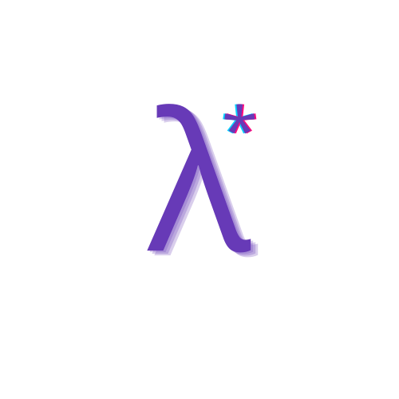

<hr>

<div align="center"> 
    
</div>

<div align="center"> 

### lambda_ptr

A utility for working with C-Libraries from C++

</div>

---

<div align="center"> 
    
### Basic Examples

</div>

> Using lambdas with capture as a function pointer

```cpp
extern "C" void some_c_function(void (*callback)(int a))
{
    // ...
}

std::string some_string;

some_c_function(lambda_ptr::pointer_to([&](int)
{
    some_string = "Captured by reference!";
}));
```

<br/>

> A utility for passing `void*` user data
```cpp
extern "C" void some_c_function(void (*callback)(int a, void* user_data), void* user_data)
{
    // ...
}

std::string some_string;
auto user_data = lambda_ptr::user_data(some_string);

some_c_function(+[](int a, void* data) {
    auto &[some_string] = decltype(user_data)::from(data);
    some_string = "Easy user-data!";
}, &user_data);
```

---

<div align="center"> 
    
### Installation

</div>

> **Note**  
> This library requires a C++20 capable compiler.

- FetchContent

    ```cmake
    include(FetchContent)
    FetchContent_Declare(lambda_ptr GIT_REPOSITORY "https://github.com/Curve/lambda_ptr")

    FetchContent_MakeAvailable(lambda_ptr)
    target_link_libraries(<YourLibrary> lambda_ptr)
    ```

- Git Submodule

    ```bash
    git submodule add "https://github.com/Curve/lambda_ptr"
    ```
    ```cmake
    # Somewhere in your CMakeLists.txt
    add_subdirectory("<path_to_lambda_ptr>")
    target_link_libraries(<YourLibrary> lambda_ptr)
    ```
